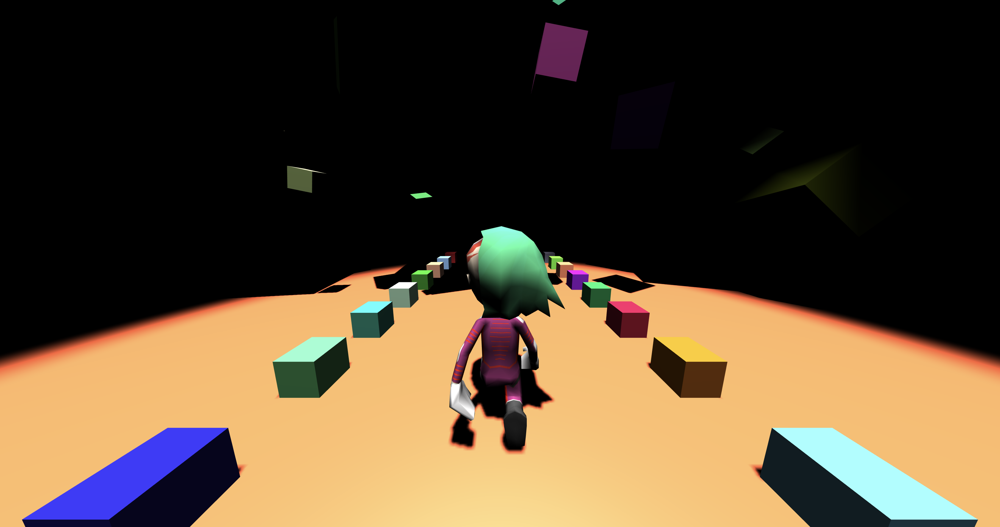

# Into the madness

Animation of a journey through magical and scary world of blocky imagination.




# Try it out
Coming soon.

# Technology
This project utilizes: node.js, three.js, webpack, es6. It was created in order for me to learn in-browser 3d game development.

It was created in a matter of few evenings and quickly grew to an unexpected size. Then I decided to make the code quality better, which was a project on it's own. Designing a proper application structure and abstractions was and still is challenging.

Right now it's in a better shape but still needs some work, mainly on `main.js` organization and game instatiation. I would also like to add more animations and a game menu. There is also some work on unifying JS codestyle. You may learn some lessons from the code though, it shows what can be achieved starting from three.js embeded via a script tag and ending in a full-fledged modularized and built using webpack web application.

## Run for development/showcasing
```
npm i
npm start
```

## Acknowledgements

Thanks to Arturo Paracuellos / [@arturitu](http://twitter.com/arturitu) ( [Unboring.net](http://www.unboring.net) ) for an excelent [tutorial](http://unboring.net/workflows/animation.html) on character animation. The model for this project was created by him and slightly retextured by myself.

Music included is distributed under Creative Commons license. I really want to give proper attribution but I can't find author information. If you know anything, please let me know.
